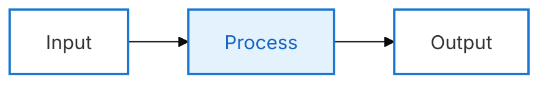
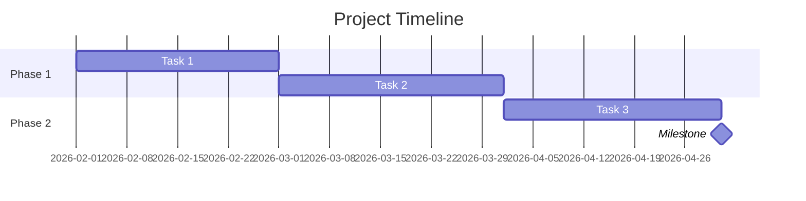
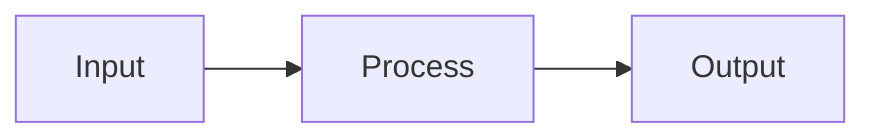

# Mermaid Diagram Generator

Generate high-quality Mermaid diagram code based on user requirements.

## Workflow

1. **Understand Requirements**: Analyze user description to determine the most suitable diagram type
2. **Read Documentation**: Read the corresponding syntax reference for the diagram type
3. **Generate Code**: Generate Mermaid code following the specification
4. **Apply Styling**: Apply appropriate themes and style configurations

## Diagram Type Reference

Select the appropriate diagram type and read the corresponding documentation:

| Type | Documentation | Use Cases |
| ---- | ------------- | --------- |
| Flowchart | [flowchart.md](references/flowchart.md) | Processes, decisions, steps |
| Sequence Diagram | [sequenceDiagram.md](references/sequenceDiagram.md) | Interactions, messaging, API calls |
| Class Diagram | [classDiagram.md](references/classDiagram.md) | Class structure, inheritance, associations |
| State Diagram | [stateDiagram.md](references/stateDiagram.md) | State machines, state transitions |
| ER Diagram | [entityRelationshipDiagram.md](references/entityRelationshipDiagram.md) | Database design, entity relationships |
| Gantt Chart | [gantt.md](references/gantt.md) | Project planning, timelines |
| Pie Chart | [pie.md](references/pie.md) | Proportions, distributions |
| Mindmap | [mindmap.md](references/mindmap.md) | Hierarchical structures, knowledge graphs |
| Timeline | [timeline.md](references/timeline.md) | Historical events, milestones |
| Git Graph | [gitgraph.md](references/gitgraph.md) | Branches, merges, versions |
| Quadrant Chart | [quadrantChart.md](references/quadrantChart.md) | Four-quadrant analysis |
| Requirement Diagram | [requirementDiagram.md](references/requirementDiagram.md) | Requirements traceability |
| C4 Diagram | [c4.md](references/c4.md) | System architecture (C4 model) |
| Sankey Diagram | [sankey.md](references/sankey.md) | Flow, conversions |
| XY Chart | [xyChart.md](references/xyChart.md) | Line charts, bar charts |
| Block Diagram | [block.md](references/block.md) | System components, modules |
| Packet Diagram | [packet.md](references/packet.md) | Network protocols, data structures |
| Kanban | [kanban.md](references/kanban.md) | Task management, workflows |
| Architecture Diagram | [architecture.md](references/architecture.md) | System architecture |
| Radar Chart | [radar.md](references/radar.md) | Multi-dimensional comparison |
| Treemap | [treemap.md](references/treemap.md) | Hierarchical data visualization |
| User Journey | [userJourney.md](references/userJourney.md) | User experience flows |
| ZenUML | [zenuml.md](references/zenuml.md) | Sequence diagrams (code style) |

## Configuration & Themes

- [Theming](references/config-theming.md) - Custom colors and styles
- [Directives](references/config-directives.md) - Diagram-level configuration
- [Layouts](references/config-layouts.md) - Layout direction and spacing
- [Configuration](references/config-configuration.md) - Global settings
- [Math](references/config-math.md) - LaTeX math support

## Output Specification

Generated Mermaid code should:

1. Be wrapped in ```mermaid code blocks
2. Have correct syntax that renders directly
3. Have clear structure with proper line breaks and indentation
4. Use semantic node naming
5. **NO COLOR STYLING** - Keep diagrams clean and simple without colors
6. Use minimal, professional style focusing on clarity

## Default Style Guidelines

**IMPORTANT**: Follow these style rules for all diagrams:

- ✅ **NO custom colors** - Use default styling only
- ✅ **White/transparent background** - Clean and professional
- ✅ **Minimal nodes** - Only essential information
- ✅ **Clear labels** - Concise text without redundancy
- ✅ **Simple structure** - Linear flows preferred over complex graphs

**Gantt Chart Style** (Recommended for timelines and schedules):
- Use `gantt` type for project timelines, schedules, roadmaps
- Clean section-based organization
- Milestones for key achievements
- No custom colors needed

**When generating PNG with mmdc**:
```bash
# Use professional theme with config
mmdc -i diagram.mmd -o diagram.png -w 1200 -H 600 -b white -c config.json
```

**Professional Theme Config** (create as `config.json`):

**Option 1: Clean Business Style (Recommended)**
```json
{
  "theme": "base",
  "themeVariables": {
    "primaryColor": "#ffffff",
    "primaryTextColor": "#333333",
    "primaryBorderColor": "#1976d2",
    "lineColor": "#888888",
    "secondaryColor": "#f5f5f5",
    "tertiaryColor": "#e3f2fd",
    "tertiaryBorderColor": "#1976d2",
    "tertiaryTextColor": "#1565c0",
    "fontFamily": "Inter, Segoe UI, Roboto, sans-serif",
    "fontSize": "12px"
  },
  "flowchart": {
    "curve": "cardinal",
    "nodeSpacing": 50,
    "rankSpacing": 50,
    "padding": 20
  },
  "gantt": {
    "titleTopMargin": 25,
    "barGap": 4,
    "topPadding": 50,
    "sidePadding": 75,
    "gridLineStartPadding": 10,
    "fontSize": 12,
    "sectionFontSize": 14
  }
}
```

**Option 2: Neutral Print Style (For PDF/Print)**
```json
{
  "theme": "neutral",
  "themeVariables": {
    "fontFamily": "Inter, sans-serif",
    "fontSize": "12px"
  },
  "flowchart": {
    "curve": "basis",
    "nodeSpacing": 50,
    "padding": 20
  }
}
```

**Advanced Styling with classDef:**


This creates modern, polished diagrams with:
- ✨ Professional Neo-inspired look
- 📐 Optimal spacing and padding
- 🎨 Subtle blue accent (#1976d2)
- 🔤 Modern typography (Inter font)
- 📊 Clean gantt chart styling

**Avoid**:
- ❌ Multiple colors (style fill:#color)
- ❌ Complex nested subgraphs
- ❌ Excessive node styling
- ❌ Decorative elements

## Example Output

**Simple Flowchart** (No colors):


**Gantt Chart** (Recommended for timelines):


**Simple Process Flow**:


---

User requirements: $ARGUMENTS
